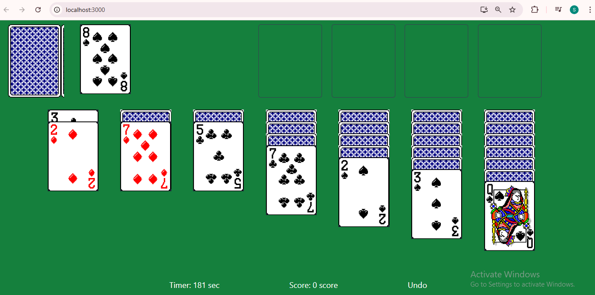
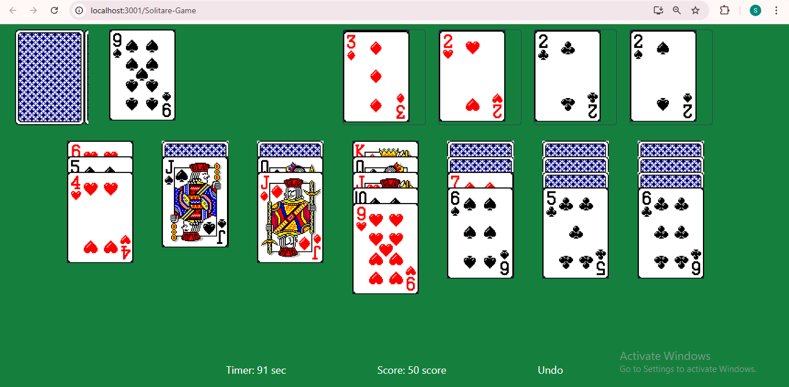
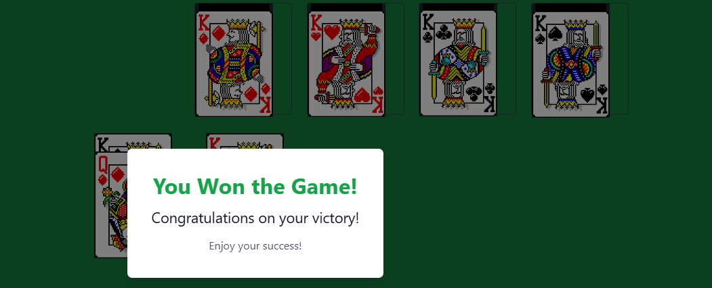

# Solitaire Game

## Description
This project is a digital adaptation of the classic solitaire card game built using modern web technologies on klondikle game rules. It features an interactive user interface, leveraging tailwind CSS for styling, JavaScript for interactivity, React JS for component-based UI development.This project is built using basic Data structures for its implementation. 

## Features

- **Data Structure**: LinkedList,stack,queue,array implementation.
- **Scoreboard**: Tracks and displays the player's score and time.
- **Validation and Testing**: Valid moves, Card flipping and wincondition testing

## Preview Link

## Game Rules

Klondike Solitaire is played with a single deck of 52 cards. The goal is to move all the cards to the foundation piles in ascending order, separated by suit. Here’s how to set up and play:

### Setup
1. **Tableau (Main Area)**: The tableau consists of seven columns.
   - The first column contains 1 card, the second column has 2 cards, the third has 3, and so on until the seventh column, which has 7 cards.
   - Only the top card in each column is face-up; all others are face-down.
2. **Foundation**: There are four foundation piles, one for each suit (Hearts, Diamonds, Clubs, Spades). These piles start empty and will be built from Ace to King.
3. **Stockpile**: The remaining 24 cards are placed in a stockpile, which you can draw from during the game.

### Game Objective
The objective of Klondike Solitaire is to move all cards to the foundation piles in ascending order (Ace to King) and by suit.

### Gameplay Rules
1. **Moving Cards in the Tableau**:
   - You can move a face-up card (or a sequence of cards) in descending order and in alternating colors (e.g., a black 6 can be placed on a red 7).
   - Only Kings or sequences beginning with a King can be placed in empty tableau columns.
   - You may turn over a face-down card if it’s the top card in a tableau column.

2. **Using the Stockpile**:
   - You may draw one card at a time from the stockpile and play it to either the tableau or foundation, or discard it.
   - If you’ve cycled through the stockpile, you can reshuffle and start again depending on game settings (some versions limit the number of cycles).

3. **Building Foundations**:
   - Cards must be moved to the foundation in ascending order by suit, starting with the Ace and ending with the King.
   - Once a card is in a foundation pile, it can’t be removed.

### Winning the Game
You win if you successfully move all cards to the foundation piles in the correct order.

## Strategies
1. **Expose Hidden Cards**: Prioritize moves that reveal hidden cards in the tableau to increase available moves.
2. **Empty Columns for Kings**: Clear tableau columns when possible to create space for a King, which can start a new sequence.
3. **Be Strategic with the Stockpile**: Only draw from the stockpile when no moves are available in the tableau, as cycling through the stockpile can limit options.
4. **Focus on Building Foundations**: Move cards to the foundations when it doesn't disrupt your ability to make other necessary moves in the tableau.
## Screenshots

### Game Mode
Game Menu 
Game Menu MidWay
Win Page

## How to run the game

In the project directory, you can run:

### `npm start`

Runs the app in the development mode.\
Open [http://localhost:3000](http://localhost:3000) to view it in your browser.

The page will reload when you make changes.\
You may also see any lint errors in the console.

### `npm test`

Launches the test runner in the interactive watch mode.\
See the section about [running tests](https://facebook.github.io/create-react-app/docs/running-tests) for more information.

### `npm run build`

Builds the app for production to the `build` folder.\
It correctly bundles React in production mode and optimizes the build for the best performance.

The build is minified and the filenames include the hashes.\
Your app is ready to be deployed!

See the section about [deployment](https://facebook.github.io/create-react-app/docs/deployment) for more information.

### `npm run eject`
### Dependencies
Following dependencies are required to run the game:
- Node JS
